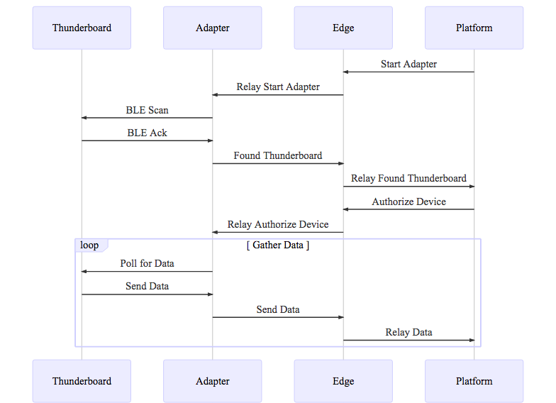

# ipm package: thunderboard-visualization

## Overview

This package has been successfully deployed to both a Raspberry Pi and an NXP imx6 modular gateway. Whichever edge you use searches for and connects to any nearby Thunderboards via BLE. The gateway gathers data from the Thunderboards, and then forwards it to the platform. The platform then displays the data in a graph in the AnomalyDetection portal.

This is an ipm package, which contains one or more reusable assets within the ipm Community. The 'package.json' in this repo is a ipm spec's package.json, [here](https://docs.clearblade.com/v/3/6-ipm/spec), which is a superset of npm's package.json spec, [here](https://docs.npmjs.com/files/package.json).

[Browse ipm Packages](https://ipm.clearblade.com)

What this system does:

## Setup
1. Flash the firmware of your Thunderboard so the advertisement period for connecting via BLE lasts indefinitely. See the ClearBlade Adapters ThunderBoard Sense Firmware Config pdf for reference.
2. Create a system on the ClearBlade platform and install this IPM.
3. Go to the Users tab and create a User. Make sure you can remember your password.
4. Go to the Adapters tab, select the ThunderBoardAdapter adapter, click the pencil edit icon next to Configuration, and download the pythonScanner.py file. Open it up and change the credentials at the start of the file. Leave the platformURL alone, you can find the System Key and System Secret on the platform if you select the info tab, and then the System Settings subtab. The username and password will be the same as the User you just created. After you've changed the credentials, save the file, go back to the edit configuration modal in the Adapters tab, and replace the python scanner file.
5. Go to the Edges tab, click on the gear icon next to the already created edge named ThunderboardOnPi. Select Setup Instructions, and change the target dropdown to Linux 32bit-ARM. Don't close this.
6. SSH into your gateway and navigate to the directory you want the edge and adapter software to be in. Go back to your browser, and in the modal you didn't close from the last instrcution, press the copy button next to the Download textbox. Go back to your terminal, paste the instruction, and run it. Do this for Download, Unzip, Install, Permission. You will also need to do this for the command at the very bottom (starts with edge, should have a copy button), BUT you need to put nohup in front of that command so it will log all of it's output in a nohup.out file instead of your terminal.
7. Go back to your ClearBlade system, and go to the Adapters tab. Select the ThunderBoardAdapter adapter, select the ThunderboardOnPi edge, and press the play button.
8. Congratualtions, you're done! Wait for a minute or two and go to the devices tab. If your gateway found a Thunderboard it should have created a device there. You can also check the Messages tab, if you don't see any MQTT messages with thunderboard in the topic name then something went wrong.

## Usage
Once you have setup the system and followed all of the instructions, you should get MQTT messages on the platform several times a minute with data collected from the Thunderboard.

# Assets	

## Code Services
  AddThunderboardDevice - Checks if a thunderboard device exists in the device table, if yes then sends authentication message back to gateway.

## Code Triggers
  NewThunderboardDevice - triggers on MQQT message published to +/status/+   

# API

## Functions

<dl>
<dt><a href="#AddThunderboardDevice">AddThunderboardDevice(body)</a></dt>
<dd>
When the gateway detects a thunderboard via BLE, it checks to see if it 
has configuration values that match a device in the device table. If not it creates a device. This code
service triggers when a MQQT message is sent for the above reason, and if 
there does exist a matching device then it sends a message back to the 
gateway authenticating the device so it can start gathering data.

</dd>
</dl>

## AddThunderboardDevice(body)
When the gateway detects a thunderboard via BLE, it checks to see if it 
has configuration values that match a device in the device table. This code
service triggers when a MQQT message is sent for the above reason, and if 
there does exist a matching device then it sends a message back to the 
gateway authenticating the device so it can start gathering data.

**Kind**: global function  

| Param | Type | Description |
| --- | --- | --- |
| body | <code>Object</code> | contains the MQQT status message sent from the gateway |
| body.status | <code>string</code> | should always be "New" if it exists |
| body.deviceId | <code>int</code> | is the name of the device specified in the adapter, should match the name of a device in the device table |

